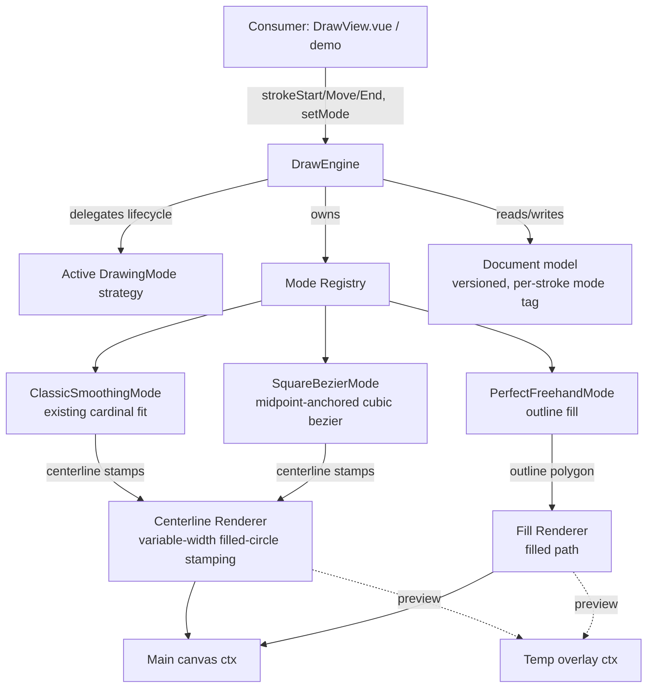
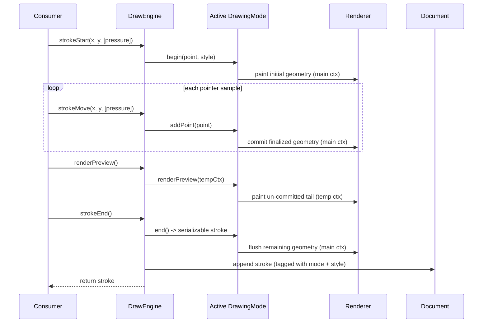

# Design Document: Drawing Modes

## Overview

Today `DrawEngine` hard-codes a single stroke-rendering algorithm: tangent-based piecewise cubic (Hermite/cardinal) curve fitting with error-bounded knot removal, rendered by stamping radial-gradient dots along the fitted centerline. This feature introduces **selectable drawing modes** so that algorithm becomes one of several interchangeable strategies, alongside two new approaches the user researched:

1. **Square Bezier smoothing** — the "Smoother Signatures" technique (as implemented by signature_pad): fit a cubic Bézier through each group of consecutive raw input points, then stamp filled circles of velocity-derived, variable width along that curve, producing clean signature-style strokes that taper with pen speed.
2. **perfect-freehand** — Steve Ruiz's approach, which generates a closed, filled polygon *outline* around the input points, yielding pressure/velocity-responsive variable-width strokes.

The central design problem is that these three approaches are not just different curve-fitting math; they have different **rendering pipelines**. The existing mode and Square bezier both draw a **variable-width centerline by stamping filled circles** — they differ in the curve-fitting math (cardinal/Hermite fit vs. midpoint-anchored cubic Bézier) and in how per-stamp width is derived (radius/pressure vs. pointer velocity), but share the same centerline-stamping renderer family. perfect-freehand, by contrast, fills an outline polygon. The design therefore introduces a **drawing-mode strategy abstraction** that encapsulates each mode's point ingestion, curve fitting, live-preview rendering, and committed rendering behind a uniform contract that `DrawEngine` drives without knowing the internals.

A second concern is **persistence fidelity**. Strokes are serialized into a versioned document and reloaded via `redraw()` / `setDocument()`. Because each mode renders differently, every stroke must record which mode produced it so it can be reproduced faithfully. Modes also need richer per-point data than the current model carries: perfect-freehand needs `pressure`, and the Square bezier mode needs a per-point `time` value to compute pointer velocity. The design bumps the document version, tags strokes with their mode, adds these optional per-point fields, and keeps older documents loading unchanged.

The core package stays framework-independent. `DrawView.vue` gains a mode prop and forwards it; the demo gains a mode selector. All work follows the workspace JavaScript / ES module / Airbnb conventions.

## Architecture

The engine is refactored so that mode-specific behavior lives behind a `DrawingMode` strategy interface. `DrawEngine` retains its public API and lifecycle orchestration but delegates the "how" of ingesting points, previewing, and committing to the active mode. Each mode owns (or references) a renderer appropriate to its output shape (centerline stamping vs. outline fill).



### Stroke Lifecycle Across Modes

The lifecycle (`strokeStart` → `strokeMove`* → `renderPreview` → `strokeEnd`) is preserved. `DrawEngine` forwards each call to the active mode, which decides how to accumulate points, when to commit geometry to the main context, and what to paint on the temp overlay for live preview.



## Components and Interfaces

### Component 1: DrawingMode (strategy interface)

**Purpose**: A uniform contract that every drawing mode implements so `DrawEngine` can drive any mode identically. It encapsulates the full per-stroke pipeline: ingest raw points, fit geometry, render the committed stroke to the main context, render the live preview to the temp overlay, and re-render a stored stroke on load.

**Contract (conceptual responsibilities, not signatures)**:
- **Identity** — a stable string `id` (e.g. `classic`, `square-bezier`, `perfect-freehand`) written into serialized strokes.
- **Begin a stroke** — receive the first point and the current style (color, radius, and mode-specific options); paint any initial mark.
- **Add a point** — accept subsequent samples (including optional pressure); accumulate internal state and commit any geometry that is now final to the main context.
- **Render preview** — paint the not-yet-committed tail onto the temp overlay; idempotent and safe to call once per animation frame.
- **End a stroke** — flush remaining geometry to the main context and return a serializable stroke record (see Data Models) tagged with this mode's `id`.
- **Replay a stored stroke** — given a previously serialized stroke, reproduce its committed rendering on the main context (used by `redraw()`, `setDocument()`, `pushStroke()`). A mode must faithfully replay strokes bearing its own `id`.

**Responsibilities**:
- Own all algorithm-specific state for the in-progress stroke and reset it between strokes.
- Never touch the DOM or input events; operate only on the canvas contexts and style values handed to it by the engine.
- Decide its own render pipeline (variable-width centerline stamping or outline fill).

### Component 2: Mode Registry

**Purpose**: Maps mode ids to mode implementations and resolves the active mode. Enables lookup by id during replay so a document containing strokes from multiple modes renders each stroke with the mode that produced it.

**Responsibilities**:
- Register the three bundled modes at engine construction.
- Resolve a mode by id for both live drawing (active mode) and replay (per-stroke mode).
- Provide a well-defined fallback when a stroke references an unknown mode id (see Error Handling).

**Extensibility note**: The registry is the seam for future custom modes. This feature ships the three modes only; a public registration API can be added later without changing the strategy contract.

### Component 3: ClassicSmoothingMode

**Purpose**: Wraps the existing behavior unchanged — `VertexQueue`, tangent-based cardinal curve fitting, knot removal, corner detection, and radial-gradient dot stamping. This preserves the current look and is the default mode for backward compatibility.

**Responsibilities**:
- Reproduce exactly today's `strokeStart` / `strokeMove` / `renderPreview` / `strokeEnd` behavior and the `_processStroke` replay path.
- Emit strokes in a form that older documents can already contain (points of `{ x, y, width }`), so its output remains schema-compatible with version 1.0 strokes.

### Component 4: SquareBezierMode

**Purpose**: Implements the Square "Smoother Signatures" technique exactly as signature_pad does. Rather than stroking a native canvas path, it fits a cubic Bézier per group of four consecutive points and then **stamps filled circles of variable radius along that curve**, so the stroke tapers with pen speed. Architecturally this is a variable-width centerline **stamping** renderer, closely related to the Classic dot-stamping Centerline Renderer — not a path-stroking renderer.

**Control-point computation (high level, no code)**:
- The curve is anchored to the actual input points, not merely their midpoints. For three consecutive points `s1, s2, s3`, take the two midpoints `m1 = (s1 + s2) / 2` and `m2 = (s2 + s3) / 2`, and the segment lengths `l1 = |s1 - s2|` and `l2 = |s2 - s3|`.
- Compute a ratio `k = l2 / (l1 + l2)` (guarding against a zero total length), form a reference point `cm = m2 + (m1 - m2) * k`, then a translation `t = s2 - cm`. Translating both midpoints by `t` yields the two control points for the segment.
- A cubic Bézier then runs from `points[1]` to `points[2]` using those control points, so consecutive segments join smoothly and the curve passes through the real input points.
- **Lag-reduction detail**: when only three points have been collected, the first point is copied to the front of the buffer so a curve can be produced immediately (the buffer is otherwise kept at four points, dropping the oldest as each new point arrives).

**Variable-width stamping**:
- Per-segment start/end widths come from pointer **velocity**, not radius: `width = max(maxWidth / (velocity + 1), minWidth)`, with velocity smoothed by a `velocityFilterWeight` low-pass filter against the previous velocity/width.
- The committed geometry is produced by walking the fitted curve in small steps (`drawSteps = ceil(curveLength) * 2`) and stamping a filled circle (`ctx.arc` + `ctx.fill`) at each step, with the radius interpolated between the segment's start and end width (clamped to `maxWidth`). A lone first point renders as a single dot of `dotSize` (or the min/max midpoint when `dotSize` is 0).

**Responsibilities**:
- Accumulate raw input points (with `time`), compute per-segment control points and widths as points arrive, and commit finalized curve segments to the main context via the shared/extended **Centerline Renderer** (flat filled-circle stamping, distinct from the Classic mode's radial-gradient dot but the same stamping pipeline). Paint a trailing preview segment on the temp overlay.
- Serialize enough raw points — including per-point `time` — to recompute identical control points, velocities, and widths on replay.

### Component 5: PerfectFreehandMode

**Purpose**: Produce a variable-width, pressure/velocity-responsive stroke as a **filled outline polygon** around the input path, matching the perfect-freehand model.

**Responsibilities**:
- Collect input points with pressure; derive an outline polygon for the current point set.
- Render via the **Fill Renderer**: build a single closed path from the outline and fill it (no centerline dots). During an in-progress stroke, the committed rendering may need to be recomputed as the outline evolves; the design isolates this in the mode so the rest of the engine is unaffected.
- Serialize the input points (with pressure) plus the mode options needed to regenerate an identical outline on replay.

**Rendering-difference callout**: Because the outline is recomputed from the whole point set as it grows, this mode cannot rely on the "append-only geometry" assumption the other two modes use. The **confirmed approach** is: render the evolving outline on the **temp overlay** during the stroke — once per frame via the existing `decoupledPreview` / `renderPreview` model — and fill the **final** outline onto the **main canvas exactly once** at `strokeEnd`, keeping the main context append-only like the other modes. (An alternative of periodically re-filling the main context during the stroke was rejected because it would break the append-only main context and add redundant re-fill cost.) The mode boundary keeps this rendering decision isolated so it can change later without touching `DrawEngine`.

Note that perfect-freehand's committed/final stroke is filled onto the **main canvas — the same Canvas 2D context used by the Classic and Square bezier modes** — via the Fill Renderer. The temp overlay is used only for the live in-progress preview; there is no separate canvas for this mode.

### Component 6: DrawEngine (modified)

**Purpose**: Same public API and stroke lifecycle as today, now delegating mode-specific work to the active `DrawingMode` and tagging serialized strokes with the mode id.

**Public API additions/changes**:
- `setMode(modeId)` — switch the active mode for subsequent strokes. In-progress strokes are unaffected; the change applies to the next `strokeStart`.
- `getMode()` — return the active mode id.
- Constructor gains an optional `mode` option (default `classic`) and an optional per-mode `modeOptions` map.
- `strokeStart` / `strokeMove` / `strokeTap` accept an **optional** pressure value; existing two-argument calls remain valid.
- `redraw()` / `setDocument()` / `pushStroke()` resolve each stroke's mode via the registry (falling back to the document's default/`classic`) instead of assuming one algorithm.

**Preserved API** (unchanged behavior): `setColor`, `renderPreview`, `strokeEnd`, `clear`, `getDocument`, `popStroke`, plus existing options (`strokeRadius`, `maxError`, `tempCtx`, `decoupledPreview`, `debugPoints`).

**Responsibilities**:
- Own the registry, active mode, style state (color/radius/options), and the document.
- Translate lifecycle calls into strategy calls and manage temp-overlay clearing between strokes (as today).
- Keep mode selection orthogonal to color/size so existing watchers in `DrawView` keep working.

### Component 7: DrawView.vue (modified)

**Purpose**: Forward a mode selection into the engine and (optionally) capture pointer pressure.

**Responsibilities**:
- Add a `mode` prop (default `classic`) and a watcher that calls `engine.setMode(...)`.
- Optionally forward `PointerEvent.pressure` into `strokeStart` / `strokeMove` so perfect-freehand can respond to real pressure; when pressure is unavailable it defaults so centerline modes are unaffected.
- No other behavioral change; pointer handling, coalescing, and decoupled preview remain as they are.

### Component 8: Demo app (modified)

**Purpose**: Let users exercise the feature.

**Responsibilities**:
- Add a "mode" dropdown to the navbar mirroring the existing color/size dropdowns, bound to the `DrawView` `mode` prop. The `classic` mode is presented with the human-readable label "Classic".

## Data Models

### Stroke record (extended)

Strokes gain an optional `mode` tag and support mode-specific point data. Existing centerline modes continue to use `{ x, y, width }` points; two optional per-point fields are added so velocity- and pressure-aware modes can reproduce their strokes:

- `pressure` — used by perfect-freehand (outline width from pen pressure).
- `time` — used by SquareBezierMode (a timestamp needed to derive pointer **velocity**, which in turn drives the variable stamp width). Velocity cannot be recomputed on replay without it.

```json
{
  "mode": "perfect-freehand",
  "color": "rgba(0,0,0",
  "options": { "size": 6, "thinning": 0.5, "smoothing": 0.5, "streamline": 0.5 },
  "points": [
    { "x": 12.0, "y": 40.5, "width": 3, "pressure": 0.42 }
  ]
}
```

```json
{
  "mode": "square-bezier",
  "color": "rgba(0,0,0",
  "options": { "minWidth": 0.5, "maxWidth": 2.5, "velocityFilterWeight": 0.7, "dotSize": 0 },
  "points": [
    { "x": 12.0, "y": 40.5, "width": 1.5, "time": 1717000000000 }
  ]
}
```

**Field rules**:
- `mode` — optional string identifying the producing mode. **Absent means `classic`** (this is how backward compatibility is achieved: every existing 1.0 stroke, which has no `mode` tag, is treated as classic). New strokes written by the engine are self-describing: Classic strokes are now tagged explicitly with `"mode": "classic"`, while an absent tag in older documents still resolves to Classic.
- `color` — unchanged (the `rgba(r,g,b` prefix string used today).
- `options` — optional, mode-specific parameters required to reproduce the stroke. For perfect-freehand: size/thinning/smoothing/streamline. For square-bezier: `minWidth`, `maxWidth`, `velocityFilterWeight`, `dotSize`. Absent for modes that need none.
- `points` — array of `{ x, y, width }`, with an optional `pressure` for pressure-aware modes and an optional `time` for velocity-aware modes (SquareBezierMode). Both are additive and independent; a point may carry either, both, or neither.

### Document (versioned)

```json
{
  "drawDocumentVersion": "1.1",
  "name": "untitled",
  "defaultMode": "classic",
  "strokes": []
}
```

**Rules**:
- `drawDocumentVersion` moves to `"1.1"` to signal the extended stroke shape. Version `"1.0"` documents remain valid input and load as before (all strokes = classic).
- `defaultMode` — optional document-level fallback used when a stroke omits `mode`. Defaults to `classic`.
- New documents created by the engine are written at `1.1`.

### JSON Schema changes

`apps/demo/src/draw-document.schema.json` is updated to:
- Add `"1.1"` to the `drawDocumentVersion` enum (keeping `"1.0"` for backward-compatible reads).
- Add optional `defaultMode` (string) at document level.
- Add optional `mode` (string) and `options` (object) to the stroke object.
- Add optional `pressure` (number, typically 0..1) to the point object.
- Add optional `time` (number, epoch milliseconds) to the point object for velocity-aware modes (SquareBezierMode).
- Preserve `additionalProperties: false` while adding the new named properties so old documents still validate and new ones validate against the extended shape.

**Validation compatibility note**: because the current schema uses `additionalProperties: false`, the new fields must be added explicitly or 1.1 documents will fail validation in `DocumentEngine`. This is called out as a required, coordinated change.

## Correctness Properties

- **Mode round-trip fidelity**: For every mode, a stroke drawn, serialized, and replayed via `setDocument()` renders identically to its committed rendering at `strokeEnd` (pixel-equivalent within antialiasing tolerance).
- **Backward compatibility**: For all existing `1.0` documents, loading them after this change produces the same rendering as before (they are treated as `classic`, and classic behavior is unchanged).
- **Default preservation**: With no mode specified anywhere, the engine behaves exactly as it does today.
- **Mode isolation**: Switching modes between strokes never alters previously committed strokes; each stroke in a document renders under the mode it was created with.
- **Lifecycle uniformity**: For every mode, the sequence begin → addPoint* → end yields a serializable stroke whose replay reproduces the same geometry, and `renderPreview()` is a pure overlay operation that never mutates the main-context result.
- **Style orthogonality**: Changing color or radius mid-session affects only subsequent strokes and is independent of the active mode.
- **Unknown-mode safety**: Loading a document whose stroke references an unregistered mode id degrades gracefully (see Error Handling) rather than throwing.

## Error Handling

### Unknown mode id on replay
**Condition**: `setDocument()` / `redraw()` encounters a stroke whose `mode` is not in the registry (e.g. a document from a newer build or a future custom mode).
**Response**: Fall back to `defaultMode`, then to `classic`, to render the stroke's points as a centerline; do not throw. Log a single warning identifying the missing mode id.
**Recovery**: The stroke stays in the document unchanged, so re-saving preserves the original `mode` tag for environments that do support it.

### Unknown mode id on `setMode()`
**Condition**: Consumer requests an unregistered mode.
**Response**: Reject by keeping the current mode and surfacing a clear error/warning; the engine remains usable.
**Recovery**: Consumer selects a valid mode.

### Missing pressure data
**Condition**: A pressure-aware mode receives points without pressure (mouse input, or a device that reports 0).
**Response**: Substitute a sensible default so the outline is still generated; the stroke simply renders with uniform width.
**Recovery**: None needed; the stroke is valid.

### Schema validation of 1.1 documents
**Condition**: A 1.1 document is saved/loaded through `DocumentEngine` with the old schema.
**Response**: Prevented by the coordinated schema update; without it, validation would reject the new fields. Flagged as a required change.
**Recovery**: Update the schema alongside the engine change.

## Testing Strategy

### Unit Testing Approach
- **Per-mode lifecycle**: For each mode, drive begin → addPoint* → end against a mock/stub 2D context and assert the mode emits a well-formed serializable stroke tagged with the correct `id`.
- **ClassicSmoothingMode parity**: Golden-master the existing engine output (recorded draw calls against a fake context) and assert the refactored classic mode produces the identical call sequence — this guards the "behavior unchanged" property.
- **Registry resolution**: Lookup by id, active-mode switching, and unknown-id fallback.
- **Document versioning**: Loading a `1.0` document treats all strokes as classic; a `1.1` document routes strokes to their tagged modes.

### Property-Based Testing Approach
Use property-based tests to exercise round-trip and isolation properties across randomized point sequences and mode selections.
**Property Test Library**: fast-check (JavaScript, fits the ES-module/Airbnb toolchain).
- **Round-trip**: random point streams → draw → serialize → replay yields an equivalent recorded call sequence per mode.
- **Mode isolation**: random sequences of (mode, stroke) pairs replay each stroke under its own mode regardless of order.
- **Backward compatibility**: randomly generated `1.0`-shaped documents replay identically before and after the change.

### Integration Testing Approach
- Drive `DrawView.vue` with synthesized pointer events (including pressure) for each mode and confirm the engine receives the right calls and the emitted `stroke` carries the expected `mode`.
- Exercise the demo save → load cycle through `DocumentEngine` with the updated schema for documents containing mixed-mode strokes.

## Performance Considerations

- **perfect-freehand recompute cost**: The outline is regenerated from the growing point set, which is O(n) per sample and O(n²) over a stroke if done naively every move. The chosen approach draws the evolving outline only on the temp overlay per frame (bounded by the existing `decoupledPreview` + `renderPreview` once-per-frame model) and fills the final outline to the main canvas once at `strokeEnd`. This keeps the main context append-only like the other modes.
- **Coalesced input**: The existing `coalesceInput` / `maxPointsPerMove` decimation in `DrawView` continues to bound per-frame work for all modes.
- **Centerline modes**: No performance change; classic and Square bezier remain incremental/append-only.

## Security Considerations

- **Dependency decision (perfect-freehand)**: `perfect-freehand` is added as a **direct runtime dependency of `packages/core`**, pinned to an exact version (per workspace standards) rather than a range. There is no separate adapter or optional package. `perfect-freehand` is a small, focused, widely used MIT library, so depending on it is preferable to reimplementing the outline algorithm in-house, which would risk subtle divergence from the well-known output. Pinning the exact version limits supply-chain exposure and keeps replay deterministic across installs. This becomes `packages/core`'s first runtime dependency (it was previously dependency-free).
- **Untrusted documents**: Loaded documents are already treated as data and validated against the schema; the new `mode`/`options` fields are used only to select a registered renderer and are never executed as code. Unknown ids fall back safely.
- **signature_pad attribution / licensing**: The Square bezier technique is studied from **signature_pad**, which is **MIT licensed (Copyright 2018 Szymon Nowak)**. That repository lives only as a **local, gitignored reference** at `reference/signature_pad`; it is neither vendored into the packages nor shipped. `SquareBezierMode` is a from-scratch implementation of the documented technique and adds **no runtime dependency**. If any snippet is ported directly rather than reimplemented, the MIT license text and copyright notice must be retained alongside it.

## Dependencies

- **perfect-freehand** (added to `packages/core`, pinned exact version) — outline generation for `PerfectFreehandMode`. This becomes `packages/core`'s first runtime dependency; there is no separate adapter package.
- **fast-check** (dev dependency) — property-based testing.
- No new dependency for Square bezier or the classic mode; both use native Canvas 2D APIs already available. The Square bezier algorithm is reimplemented from the MIT-licensed **signature_pad** (Copyright 2018 Szymon Nowak), kept only as a gitignored reference at `reference/signature_pad` and not shipped; retain the MIT attribution if any code is ported verbatim.
- `apps/demo/src/draw-document.schema.json` — must be updated in lockstep with the document model (not a package dependency, but a coordinated change).

## Backward Compatibility Summary

- Existing `DrawEngine` public methods keep their signatures; new parameters are optional and additive.
- `1.0` documents load and render unchanged (absent `mode` ⇒ `classic`). New documents written by the engine explicitly tag Classic strokes with `"mode": "classic"`, so they are self-describing while older docs with an absent tag still resolve to Classic.
- Default mode is `classic`, so consumers that never opt into modes see no behavioral change.
- `DrawView` gains an optional `mode` prop defaulting to `classic`; existing usages are unaffected.
